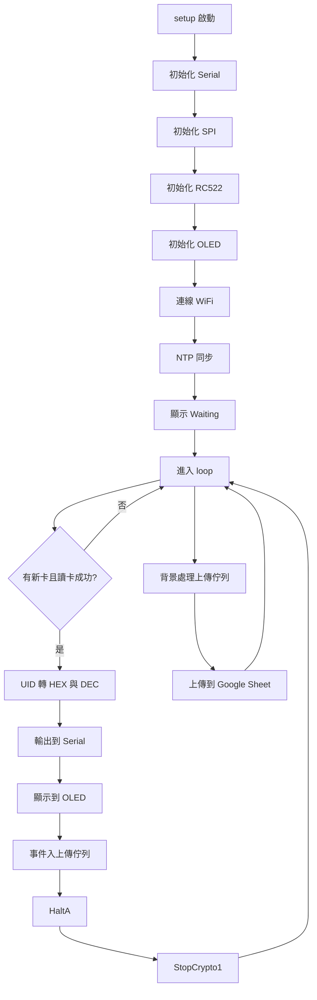

# RFID RC522 UID 讀取(branch-add_wifi)

本專案使用 ESP32 (NodeMCU-32S) 搭配 RC522 RFID 讀卡模組，讀取卡片 UID 後，同步輸出到 Serial 與 1.3 吋 SH1106 OLED。

重點行為如下：

1. OLED 顯示 HEX 與 DEC(Big Endian) 兩種 UID 格式。
2. 卡片拿開後畫面保留，不會自動清空。
3. 感應到下一張卡片時，才更新畫面內容。
4. DEC 轉換支援 10-byte UID，不會因 64 位整數上限而溢位。
5. 開機後自動連接 WiFi，並進行 NTP 時間同步。
6. 每次讀卡流程為「先更新 OLED，再上傳 Google Sheet」。
7. 上傳欄位為 datetime、uid_raw、uid_big_endian；datetime 格式為 yyyy/mm/dd hh:mm:ss。
8. 上傳採背景佇列處理，讀卡主流程不會被網路請求阻塞。
9. 內建上傳重試與去抖動機制，提升大量刷卡與網路抖動下的穩定性。

---

## 硬體元件

| 元件 | 型號 | 介面 |
|---|---|---|
| 微控制器 | ESP32 NodeMCU-32S | - |
| RFID 讀卡模組 | MFRC522 (RC522) | SPI (VSPI) |
| OLED 顯示器 | 1.3" SH1106 128x64 | I2C |

---

## 接腳對應表

### RC522 -> ESP32

| RC522 腳位 | ESP32 GPIO | 說明 |
|---|---|---|
| SDA (SS) | GPIO 5 | SPI 片選 |
| SCK | GPIO 18 | SPI 時脈 (VSPI) |
| MOSI | GPIO 23 | SPI 主出從入 (VSPI) |
| MISO | GPIO 19 | SPI 主入從出 (VSPI) |
| RST | GPIO 4 | 模組重置 |
| IRQ | 不連接 | 中斷 (本專案未使用) |
| 3.3V | 3.3V | 電源 (請勿接 5V) |
| GND | GND | 接地 |

### SH1106 OLED -> ESP32

| OLED 腳位 | ESP32 GPIO | 說明 |
|---|---|---|
| SCL | GPIO 22 | I2C 時脈 |
| SDA | GPIO 21 | I2C 資料 |
| VCC | 3.3V | 電源 |
| GND | GND | 接地 |

I2C 位址通常是 0x3C，部分模組是 0x3D。

---

## 接線示意圖

```text
ESP32 NodeMCU-32S
┌───────────────────────────────┐
│ GPIO5  ─────── SDA (SS)       │◄── RC522
│ GPIO18 ─────── SCK            │◄── RC522
│ GPIO23 ─────── MOSI           │◄── RC522
│ GPIO19 ─────── MISO           │◄── RC522
│ GPIO4  ─────── RST            │◄── RC522
│ 3.3V   ─────── 3.3V           │◄── RC522 & OLED
│ GND    ─────── GND            │◄── RC522 & OLED
│                               │
│ GPIO22 ─────── SCL            │◄── OLED SH1106
│ GPIO21 ─────── SDA            │◄── OLED SH1106
└───────────────────────────────┘
```

---

## 顯示與輸出行為

### 待機畫面

```text
RFID Reader
Waiting...
```

### 偵測到卡片時

```text
HEX:
A3 F2 01 5B
DEC:(Big Endian)
2751234395
----------------
Wait another card:...
```

卡片移開後，畫面保持最後一次資料；直到刷下一張卡才更新。

### Serial 輸出格式 (115200)

```text
Card detected!
UID HEX: A3 F2 01 5B
UID DEC:(Big Endian) 2751234395
```

若啟用雲端上傳，會額外顯示：

```text
Sheet upload HTTP code: 200
```

若有轉址流程，會顯示 initial 與 follow 狀態碼：

```text
Sheet upload HTTP code: 302 -> 200
```

非 2xx 時會再顯示伺服器回應片段，方便除錯。

---

## 詳細程式架構與邏輯說明

### 模組分工

1. RFID 讀卡層
使用 MFRC522 函式庫負責卡片偵測與 UID 讀取。
核心 API：PICC_IsNewCardPresent、PICC_ReadCardSerial、PICC_HaltA、PCD_StopCrypto1。

2. 顯示層
使用 U8g2 的全緩衝模式，每次重新繪製完整畫面再送出。
核心 API：clearBuffer、drawStr、drawHLine、sendBuffer。

3. 資料格式層
將 UID 同步轉成兩種字串：
HEX 字串：每個 byte 轉為兩位大寫十六進制，byte 間用空白分隔。
DEC 字串：以大整數十進制位數陣列運算，支援 10-byte UID。

4. 上傳佇列層
讀卡流程只負責 enqueue，背景再逐筆送出到 Google Sheet。
特色：
- 佇列滿時丟棄最舊資料，優先保留新刷卡事件。
- 單筆上傳失敗可重試（預設 2 次）。
- 可分辨 30x 轉址前後狀態碼（例如 302 -> 200）。

### 主流程 (setup 與 loop)



### DEC(Big Endian) 演算法

UID 位元組序列視為大端序整數：

$$
V = (((b_0 \times 256 + b_1) \times 256 + b_2) \times \cdots ) + b_n
$$

為避免 10-byte UID 超出 64 位整數，程式使用十進制位數陣列儲存結果。
每處理一個新 byte，就做一次：

$$
result = result \times 256 + byte
$$

最後把位數陣列反向輸出成字串，得到完整十進制結果。

### 關鍵函式說明

1. showWaiting
顯示開機待機畫面。

2. showUID
渲染 HEX/DEC 與底部等待提示。
每次先清空緩衝區，確保刷新卡時覆蓋舊畫面。

3. uidToHexCString
以 snprintf 逐段填入固定緩衝區，避免動態記憶體配置。

4. uidToDecCString
以十進制位數陣列處理大整數，避免 64-bit 溢位。

---

## 函式庫相依套件

| 函式庫 | PlatformIO 名稱 | 用途 |
|---|---|---|
| MFRC522 | miguelbalboa/MFRC522 | RC522 RFID 驅動 |
| U8g2 | olikraus/U8g2 | SH1106 OLED 驅動 |
| WiFi / WiFiClientSecure / HTTPClient | framework-arduinoespressif32 內建 | WiFi 連線與 HTTPS 上傳 |

---

## 開發環境

1. IDE: Visual Studio Code + PlatformIO
2. 平台: Espressif32
3. 框架: Arduino
4. 開發板: NodeMCU-32S

### 建構與燒錄

```bash
# 編譯
pio run

# 編譯並燒錄
pio run --target upload

# 開啟 Serial Monitor
pio device monitor --baud 115200
```

---

## 注意事項

1. RC522 與 OLED 都使用 3.3V。
2. 若 OLED 無顯示，請先檢查 I2C 位址 (0x3C/0x3D)。
3. 本專案顯示策略為資料保留式，不會在讀卡後自動回待機。
4. DEC 轉換已支援 10-byte UID；若未來改用更長 UID，需同步放大位數與緩衝區。
5. Google Sheet 上傳網址與 WiFi 憑證存放於 include/secrets.h，且已被 .gitignore 排除。
6. 如需顯示「Sheet redirect to」除錯訊息，可將 src/main.cpp 內的 SHEET_UPLOAD_DEBUG 改為 true。
7. 同 UID 於短時間內會被去抖動（預設 350ms），可透過 UID_DEBOUNCE_MS 調整。

---

## 參數調校建議表

下列參數都在主程式常數區，可依現場網路品質與刷卡頻率調整：

| 參數 | 目前值 | 建議範圍 | 調大效果 | 調小效果 | 建議情境 |
|---|---:|---:|---|---|---|
| UPLOAD_QUEUE_CAPACITY | 8 | 4 ~ 32 | 可暫存更多待送資料，斷網時較不易丟資料 | RAM 使用較低，但高流量時較容易觸發丟棄最舊資料 | 刷卡頻率高或網路偶發不穩時可先調到 12 或 16 |
| UPLOAD_MAX_RETRY | 2 | 0 ~ 5 | 暫時性網路波動下成功率提升 | 失敗可更快放棄，避免佇列卡住太久 | 網路穩定可維持 1~2；網路不穩可試 3 |
| UPLOAD_RETRY_DELAY_MS | 1500 | 500 ~ 5000 | 降低重試壓力，較不會連續打爆伺服器 | 重試更積極，恢復速度快但可能造成網路壓力 | 若 AP 容易短暫斷線，建議 1500~3000 |
| HTTP_CONNECT_TIMEOUT_MS | 1500 | 800 ~ 5000 | 可容忍較慢連線，誤判失敗較少 | 失敗回復更快，主系統反應較即時 | 內網穩定可 1000~1500；跨網路可 2500 |
| HTTP_READ_TIMEOUT_MS | 2500 | 1000 ~ 8000 | 容忍慢回應，成功率提高 | 逾時更快，不會久等回應 | Apps Script 偶發慢回應可提高到 3000~5000 |
| UID_DEBOUNCE_MS | 350 | 150 ~ 1500 | 重複感應抑制更強，減少重複上傳 | 反應更靈敏，但同卡停留時可能重複觸發 | 若卡片常停留感應區，可調到 500~800 |

### 快速調校建議

1. 刷卡快且常斷網：先調 `UPLOAD_QUEUE_CAPACITY = 16`、`UPLOAD_MAX_RETRY = 3`。
2. 追求即時反應：先調 `HTTP_CONNECT_TIMEOUT_MS = 1000`、`HTTP_READ_TIMEOUT_MS = 1500`。
3. 同卡重複觸發太多：先調 `UID_DEBOUNCE_MS = 600`。
4. 若看到大量 `Sheet upload dropped after retries.`：優先提高 `UPLOAD_MAX_RETRY` 與 `UPLOAD_QUEUE_CAPACITY`，再檢查 WiFi 品質。

---

## 專案結構

```text
RFID-RC522_esp32/
├── src/
│   └── main.cpp           # 主程式 (讀卡、轉換、顯示)
│
├── GOOGLE_SHEET_WEBHOOK_SETUP.md # Google Sheet Webhook 詳細設定手冊
├── include/
│   └── README             # 標頭檔放置說明
├── lib/
│   └── README             # 專案私有函式庫說明
├── test/
│   └── README             # 測試規劃與建議
├── platformio.ini         # PlatformIO 設定
└── README.md              # 專案總說明
```
